# Build-LLaMa: Aligning Architects' Feedback and Domain Knowledge in 3DArchitectural Design Generation
Abstract: *How can large language models (LLMs) become 3D architects? In the Architecture, Engineering, and Construction (AEC) stages, generating 3D buildings is a complex task that requires both domain expertise and alignment with user requirements. While machine learning has been increasingly applied to 3D building design, current evaluation methods often rely on statistical metrics like CD and F-score, which fail to reflect real-world human preferences and domain-specific knowledge. As a result, models that perform well on these metrics may still fail to generate practical 3D designs, as architects consider factors such as shape, aesthetics, and structural rationality.
To address this:
(1) We propose the \textbf{BuildMetricsNet}, the first 3D building dataset with textual descriptions and evaluation scores of structural feasibility, aesthetic quality, and overall spatial scores, which could be used for further fine-tuning of large language models.
(2) We introduce the \textbf{Build-LLaMa}, a novel framework that pre-trains on generations of text to 3D building mesh, and conducts further fine-tuning with architects' feedback and domain knowledge. 
(3) We comprehensively evaluate the 3D generation potential of various large language models and carefully assess RLHF effectiveness through architects' validation, providing a new benchmark for 3D generation capacity of large models and offering insights for the architectural community. The code, dataset, and model weights will be released upon acceptance.*


[**Paper**]() | [**Project Page**]() | [**Model Weights**]() | [**Huggingface Demo**]() |


*Figure 1) Architects assess 3D building schemes during the conceptual design phase from multiple professional dimensions, which can be broadly categorized into structural feasibility, aesthetic quality, and overall spatial layout.*
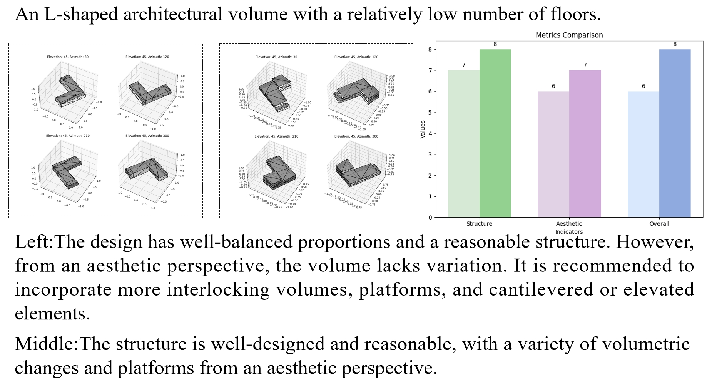

*Figure 2) An illustration of the 3D architectural forms included in the dataset.*
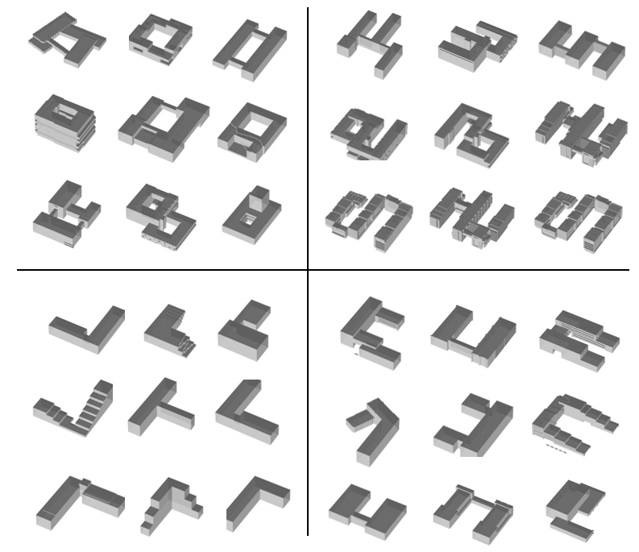

*Figure 3) Left: Structural feasibility Proportions; Right: Aesthetic Quality Proportions.*
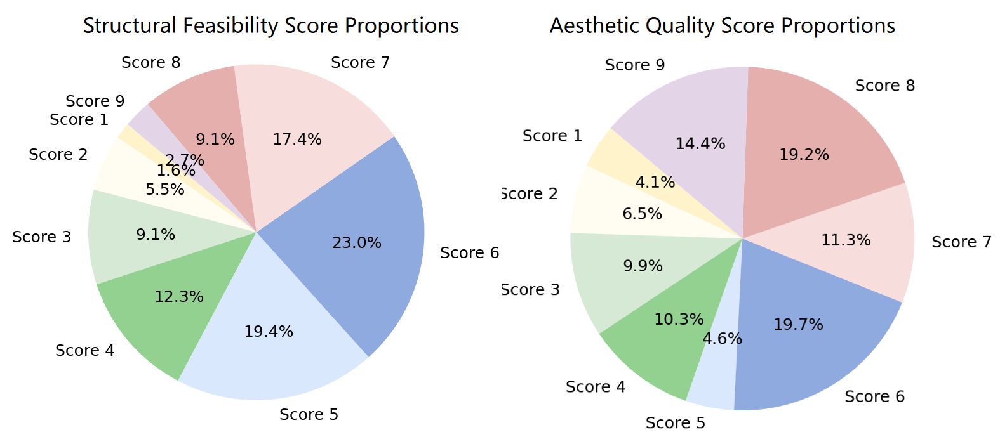

*Figure 4) Left: Overall Scores Proportions; Right: Average scores for structural quality, and overall evaluation.*
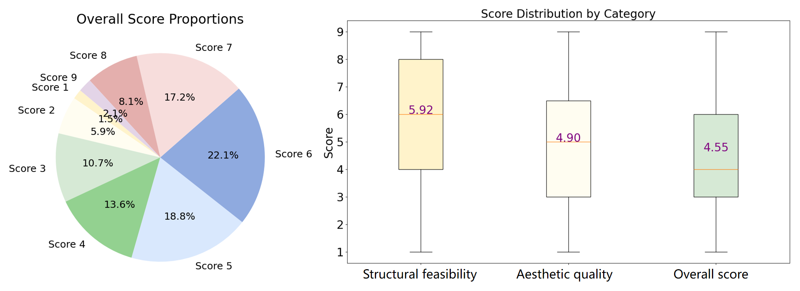

*Figure 5) Illustration of our 3D representation approach. Left: A snippet of an OBJ file represented as plain text, containing vertex (v) and face (f) definitions. Right: The 3D object rendered from the OBJ file.*
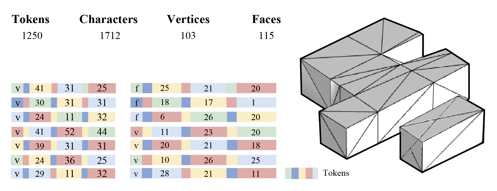

*Figure 6) Illustration of our vertex quantization method. Top: The original OBJ file represents vertex coordinates in decimal values, splitting a single coordinate into several tokens. Bottom: After quantization, we represent the vertices as integers containing fewer tokens and are processed by LLM more efficiently.*
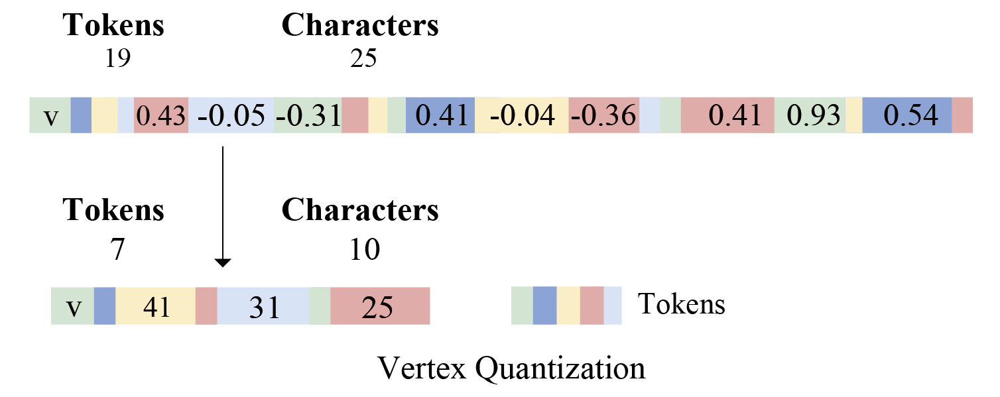

*Figure 7) Overview of Our Method. Left: We unify text and 3D mesh in a uniform format by representing the numerical values of vertex coordinates and face definitions of a 3D mesh as plain text. Right: (1) Supervised Fine-Tuning (SFT); (2) Reward Model (RM) training; and (3) Reinforcement Learning (PPO on the reward model).*
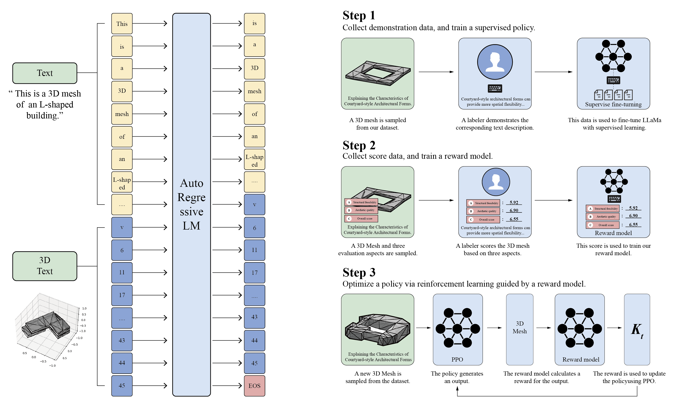

*Figure 8) An example of 3D building mesh generation.*
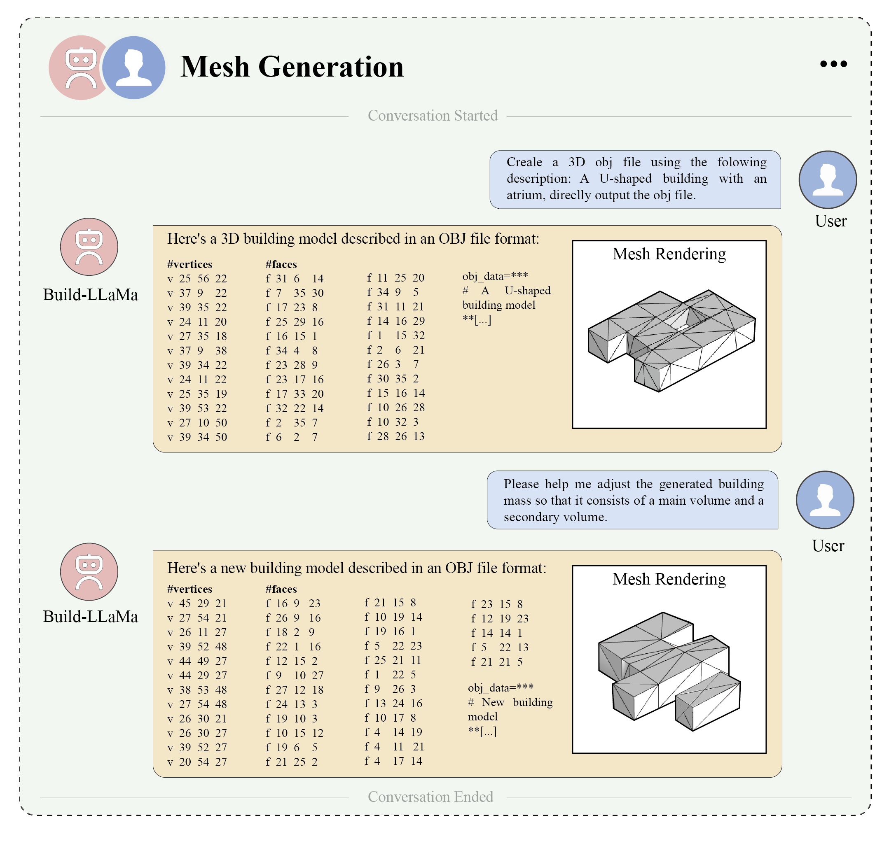

*Figure 9) (a) Design Discussion; (b) Mesh Understanding; (c) Mesh Generation.*
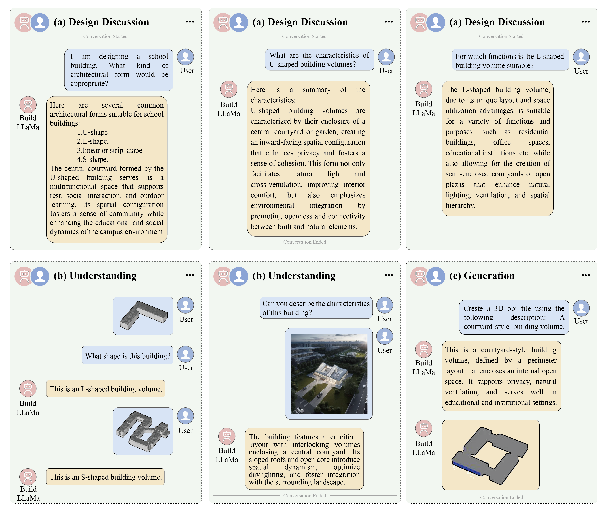

*Figure 10) Comparison of 3D building outputs that generated by various large language models based on architectural text prompts. Seven representative building types are presented to evaluate  spatial and semantic comprehension.*
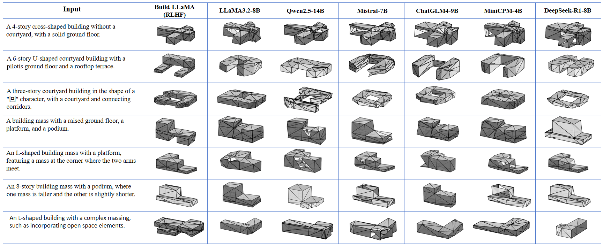

*Figure 11) Gallery of generations from the Build-LLaMa. Our method is able to generate high-quality 3D building designs.*
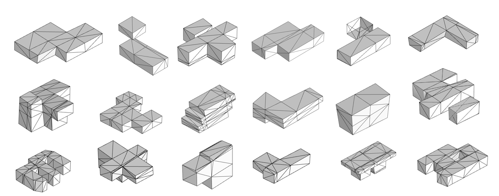

*Figure 12) Diversity of generations. Build-LLaMa can generate diverse 3D building meshes given the same text prompt.*
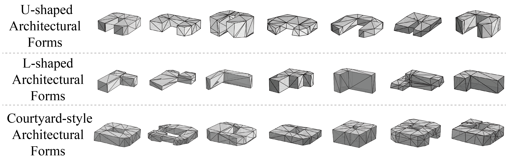

*Figure 13) Human evaluation on various LLMs.*
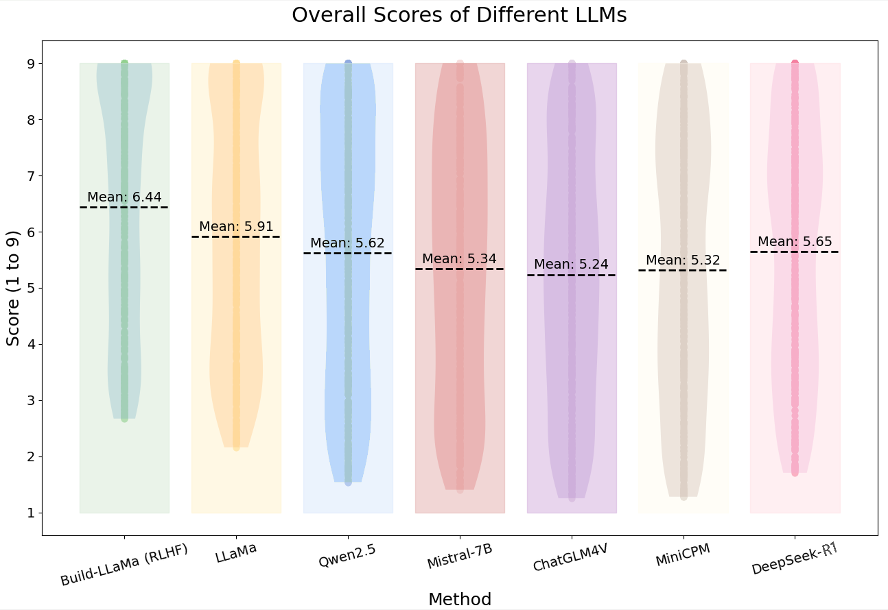

*Figure 14) Winning rates of different LLMs.*
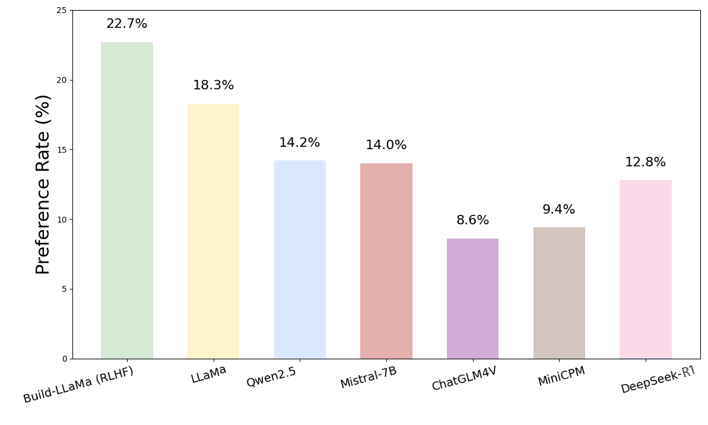

## TODO List

- [x] Release part of BuildMetricsNet dataset. 
- [ ] Release Build_LlaMa inference code and pretrain weights.
- [ ] Upload Build_LlaMa training dataset.
- [ ] Release Build_LlaMa code.


## Inference

```
python Build_LlaMa.py --dataset BuildMetricsNet --batch_size 32  --color_configuration 0 --model_path ckpts/exp/model10000.pt --num_samples 64
```
## Train

```
python Build_LlaMa.py --dataset BuildMetricsNet --batch_size 32  --color_configuration 0 
